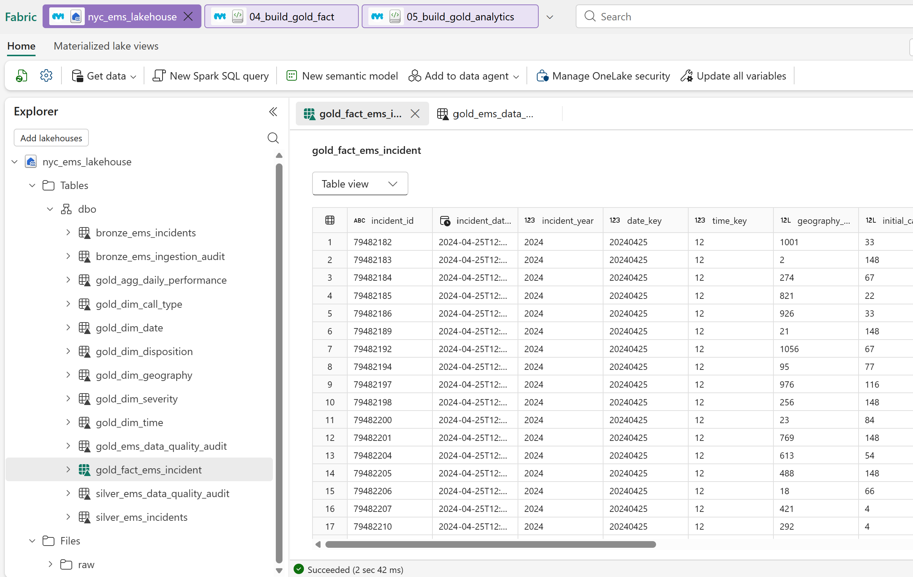
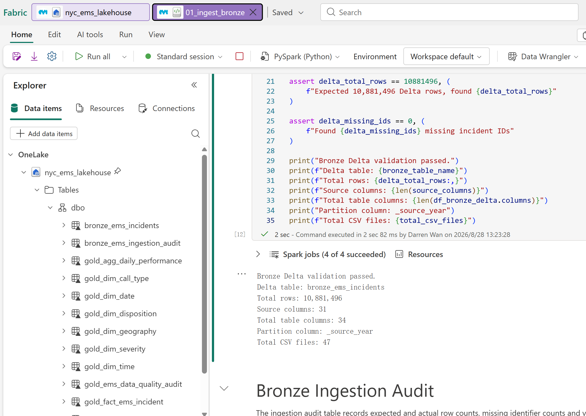
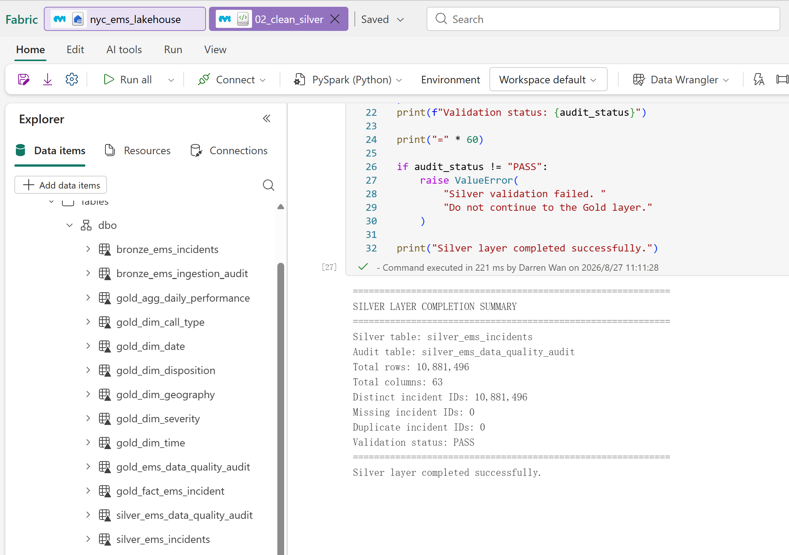
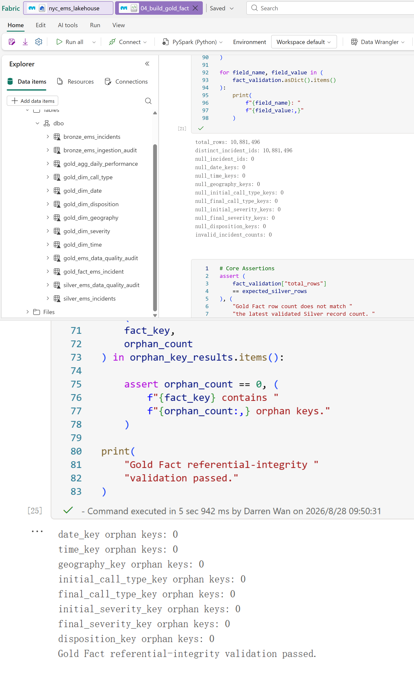
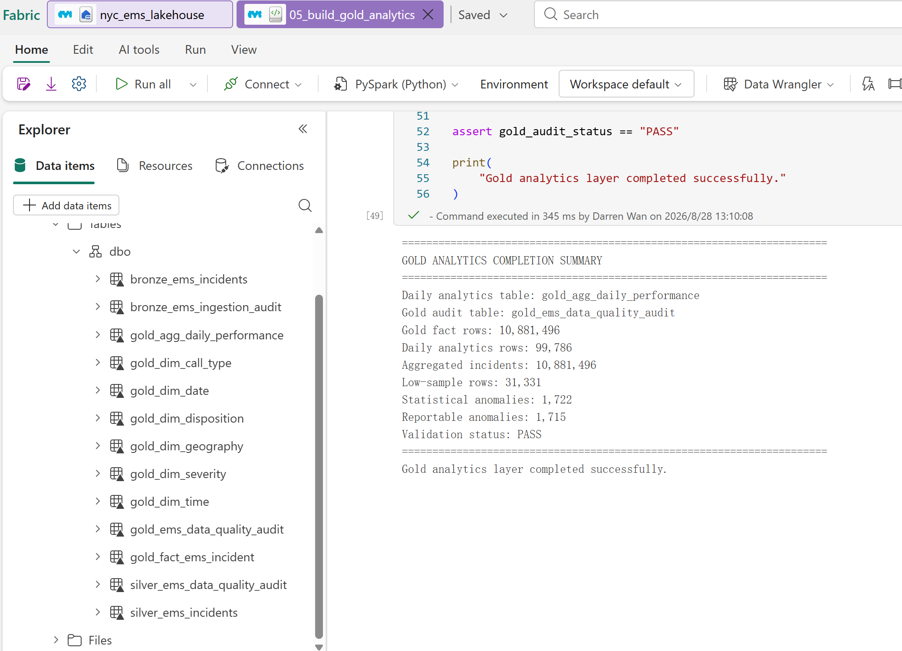

# NYC EMS Analytics

A large-scale emergency medical services (EMS) analytics portfolio project built using Microsoft Fabric, PySpark, SQL, DAX, and Power BI.

## Project Overview

This project analyses more than 10 million NYC EMS Incident Dispatch records from 2019 to 2025 to explore emergency demand, response performance, service reliability, and operational patterns across New York City.

The project demonstrates:

* Large-scale data ingestion and transformation
* Medallion architecture using Bronze, Silver, and Gold layers
* PySpark data engineering
* Data quality validation and feature engineering
* SQL analytics
* Dimensional modelling and star schema design
* Power BI semantic modelling
* DAX measures and statistical analysis
* Population standard deviation
* Upper and lower statistical control limits
* Anomaly detection
* Time-series analysis and forecasting
* Business-focused data storytelling

## Dataset

* **Source:** NYC Open Data
* **Dataset:** EMS Incident Dispatch Data
* **Dataset ID:** `76xm-jjuj`
* **Period:** 2019–2025
* **Source columns:** 31
* **Incident records:** 10,881,496
* **Source CSV files:** 47
* **Source-year partitions:** 7

Raw source files are excluded from this repository because of their size.

The dataset contains operational EMS dispatch information, including incident timestamps, call types, severity levels, geographic areas, response times, incident dispositions, and operational indicators.

> **Note:** Call types represent EMS dispatch classifications based on information available to dispatchers and should not be interpreted as confirmed clinical diagnoses.

## Business Questions

The analytical model is designed around the following business questions.

### Emergency Demand

**BQ01.** How has EMS incident volume changed over time from 2019 to 2025?

**BQ02.** At what times of day and days of the week is EMS demand highest?

**BQ03.** Which NYC boroughs experience the highest EMS incident volumes?

**BQ04.** What are the most common EMS call types?

### Response Performance and Reliability

**BQ05.** How does EMS response time vary by initial severity level?

**BQ06.** How does EMS response performance differ across NYC boroughs?

**BQ07.** Which areas have the greatest variability in EMS response times?

This question goes beyond average response time by using measures such as standard deviation, percentiles, and coefficient of variation to evaluate response reliability.

**BQ08.** Do held incidents experience longer or more variable response times than incidents that are immediately assigned?

**BQ09.** How much of total incident response time is associated with dispatch delay versus travel time?

**BQ10.** Which periods experience both high EMS demand and slower response performance?

### Incident Outcomes and Classification

**BQ11.** What are the most common EMS incident dispositions, including patient transport and non-transport outcomes?

**BQ12.** How frequently do call type and severity classifications change between the initial and final EMS dispatch records?

## Statistical Analysis

The project uses statistical measures to evaluate not only average EMS performance but also the consistency and variability of service delivery.

Key measures include:

* Mean response time
* Median response time
* Population standard deviation
* Coefficient of variation
* Percentiles (P75, P90, P95)
* Upper and lower statistical control limits
* Anomaly detection
* Time-series trends and forecasting

A particular focus is placed on identifying situations where two areas may have similar average response times but substantially different response-time variability.

## Data Architecture

The project follows a Medallion Architecture in Microsoft Fabric:

### Bronze Layer

Raw NYC EMS CSV files are ingested into a Delta table with minimal transformation.

**Output tables:**

* `bronze_ems_incidents`
* `bronze_ems_ingestion_audit`

Key Bronze validations include:

* Source file validation
* Row-count validation
* Schema validation
* Incident identifier completeness
* Incident identifier uniqueness
* Source-year partition validation

The completed Bronze layer validated 47 source CSV files, 10,881,496 incident records, 31 source columns, and seven source years. No missing or duplicate incident identifiers were found, and all yearly file-count and row-count validations passed.

### Silver Layer

The Silver layer cleans, standardises, validates, and enriches incident-level EMS data while preserving the grain of:

> **One row = one EMS incident**

Transformations include:

* String trimming and null standardisation
* Date-time conversion
* Numeric type conversion
* Indicator standardisation
* Boolean feature creation
* Valid response-time measures
* Date and time feature engineering
* Time-of-day classification
* Response-time conversion
* Call-type and severity-change indicators
* Incident-duration calculations
* Data-quality status validation

Invalid response-time observations are retained in the source fields for traceability but excluded from validated response-time measures used for statistical analysis.

**Output tables:**

* `silver_ems_incidents`
* `silver_ems_data_quality_audit`

The completed Silver table contains 10,881,496 incident-level records and 63 columns. Validation confirmed that the Silver transformation preserved the Bronze row count, introduced no duplicate or missing incident identifiers, produced no source-year mismatches, and passed the final data-quality audit.

### Gold Layer

The Gold layer provides business-ready fact and dimension tables designed around the project's business questions and Power BI analytical requirements.

The completed dimensional model supports analysis across:

* Date and time
* Geography
* Call type
* Severity
* Incident disposition
* Operational indicators
* Response performance

**Completed dimension tables:**

* `gold_dim_date`
* `gold_dim_time`
* `gold_dim_geography`
* `gold_dim_call_type`
* `gold_dim_severity`
* `gold_dim_disposition`

**Completed fact table:**

* `gold_fact_ems_incident`

The fact table preserves the incident-level grain of one row per EMS incident and contains 29 columns. It is partitioned by `incident_year` and connects to the Gold dimensions through eight foreign keys covering date, time, geography, initial and final call type, initial and final severity, and incident disposition.

Gold validation confirmed that the fact-table row count matches the Silver table, incident identifiers remain unique, yearly row counts are preserved, and no orphan dimension keys were introduced.

### Call Type Description Mapping

`gold_dim_call_type` combines the initial and final EMS dispatch classifications observed in the incident data and enriches them with descriptions from the `Call Type Descriptions` worksheet in the official NYC EMS data-description workbook.

The completed dimension contains:

* 199 call-type codes observed in the incident data
* 187 call types matched to an official description
* 12 source call types retained as `UNDOCUMENTED CALL TYPE`
* Separate indicators showing whether each call type appears as an initial classification, a final classification, or both

Call-type codes are trimmed and converted to uppercase before matching. All source values are retained through a left join. Codes that do not appear in the official reference mapping are not removed and are not assigned inferred meanings.

The 12 undocumented codes occur only as initial dispatch classifications in the current dataset. Missing source values, if introduced in future data, are represented by the controlled `UNKNOWN` member and kept separate from undocumented codes.

### Incident Disposition Mapping

`gold_dim_disposition` enriches the source disposition codes using the official NYC EMS documentation while preserving every distinct code found in Silver.

The business categories include:

* Transported
* Not Transported
* Death on Scene
* Patient Not Located / Unfounded
* Cancelled / Not Dispatched
* Duplicate Incident
* Unknown / No Disposition
* Undocumented

The source codes `82A`, `82B`, and `TELC` occur in the data but are not included in the current official mapping. They are retained unchanged, labelled as undocumented, and identified through mapping-status fields rather than removed or assigned an unsupported meaning.

### Gold Analytics Layer

The completed Gold analytics layer provides reusable daily performance measures for KPI reporting, response-time reliability analysis, statistical control charts, anomaly detection, trend analysis, and forecasting support.

The daily analytical table has the following grain:

> **One row = one incident date × borough × initial severity level**

**Output tables:**

* `gold_agg_daily_performance`
* `gold_ems_data_quality_audit`

The analytical measures include:

* Daily incident volume and valid-response coverage
* Average dispatch, incident-response, and travel time
* Population standard deviation and coefficient of variation
* P50, P75, P90, and P95 response times
* Minimum and maximum response times
* Held, special-event, and transfer incident rates
* Historical rolling centre line
* Upper and lower statistical control limits
* Statistical and reportable anomaly indicators
* Small-sample and insufficient-baseline quality flags

Control limits are calculated separately for each borough and initial severity level using the previous 30 eligible daily observations. The current observation is excluded from its own historical baseline. A daily group requires at least 30 valid incident-response records, and at least 20 eligible historical observations are required before a reportable anomaly can be produced.

The completed Gold audit confirmed that the dimensions are non-empty, fact identifiers are complete and unique, daily aggregated incident totals reconcile to the Gold fact table, the daily analytical grain contains no duplicates, and the control-limit and reportable-anomaly validations pass.

## SQL Analytics Endpoint

SQL Analytics Endpoint validation and analytical query development are complete. The SQL layer independently revalidates the persisted Gold tables and provides business-focused queries covering all 12 project questions.

| SQL file | Coverage | Status |
|---|---|---|
| [`sql/01_gold_validation.sql`](sql/01_gold_validation.sql) | Gold table accessibility, row counts, identifiers, dimension keys, foreign keys, aggregate reconciliation, statistical measures, control limits, anomaly rules, audit status, and call-type description mapping | Completed |
| [`sql/02_incident_demand_analysis.sql`](sql/02_incident_demand_analysis.sql) | Emergency demand analysis for BQ01–BQ04 | Completed |
| [`sql/03_response_performance_analysis.sql`](sql/03_response_performance_analysis.sql) | Response performance and reliability analysis for BQ05–BQ10 | Completed |
| [`sql/04_outcomes_classification_analysis.sql`](sql/04_outcomes_classification_analysis.sql) | Incident disposition and classification-change analysis for BQ11–BQ12 | Completed |

The SQL validation layer confirms:

* All Gold tables are accessible through the SQL Analytics Endpoint
* The Gold fact table contains 10,881,496 unique incident records
* All eight fact-table foreign keys are populated and have no orphan dimension keys
* Daily aggregate incident totals reconcile to the Gold fact table
* Daily analytical grain and dimension keys are unique
* Response-time totals, averages, valid-record counts, and null rules are internally consistent
* Seconds-to-minutes conversions follow the same decimal rounding rules as the Gold notebook
* Rates, percentages, coefficient-of-variation measures, control limits, and anomaly flags pass validation
* Every call type has a controlled description, while undocumented source codes remain visible

Analytical percentages use decimal arithmetic and retain six decimal places where low-frequency categories would otherwise appear as zero. Response-time measures are displayed to two decimal places to avoid unsupported precision. Weighted averages and pooled statistical formulas are used where daily aggregates are combined across groups.

The analytical queries cover demand trends, peak periods, borough patterns, call-type demand, response-time performance, variability, held incidents, response components, high-demand and slow-response periods, dispositions, call-type transitions, severity transitions, classification-change overlap, and annual outcome trends.

## Pipeline Notebooks

| Notebook | Purpose | Status |
|---|---|---|
| `01_ingest_bronze.ipynb` | Ingest and validate the raw CSV files | Completed |
| `02_clean_silver.ipynb` | Clean, type, validate, and enrich incident records | Completed |
| `03_build_gold_dimensions.ipynb` | Build and validate the Gold dimensions | Completed |
| `04_build_gold_fact.ipynb` | Build and validate the incident fact table | Completed |
| `05_build_gold_analytics.ipynb` | Build KPI, variability, control-limit, anomaly, and trend tables | Completed |

## Validation Evidence

The following screenshots provide execution evidence from Microsoft Fabric. They show the persisted Lakehouse tables and the validation results produced by the Bronze, Silver, and Gold pipelines.

### Lakehouse Tables

The Lakehouse contains the completed Bronze, Silver, Gold dimension, Gold fact, analytical aggregate, and audit tables.



### Bronze Validation

The Bronze pipeline validates the source files, source schema, yearly row counts, incident identifier completeness, and Delta-table output.



### Silver Validation

The Silver pipeline confirms row-count preservation, complete and unique incident identifiers, successful type conversion, source-year consistency, and the final data-quality status.



### Gold Fact Validation

The Gold fact validation confirms the incident-level grain, row-count reconciliation, identifier uniqueness, yearly totals, and dimension-key integrity.



### Gold Analytics Validation

The Gold analytics validation confirms fact-to-aggregate reconciliation, daily-grain uniqueness, control-limit consistency, anomaly-quality rules, and the final Gold audit status.



The Gold star-schema relationship diagram will be added after the Power BI semantic model has been created.

## Analytics Workflow

```text
NYC Open Data
      ↓
Raw CSV Files
      ↓
Bronze Layer
Raw ingestion and validation
      ↓
Silver Layer
Cleaning, validation and feature engineering
      ↓
Gold Layer
Dimensional modelling and analytical tables
      ↓
SQL Analytics Endpoint
      ↓
Power BI Semantic Model
      ↓
DAX + Statistical Analysis
      ↓
Interactive Dashboard
      ↓
Business Insights and Recommendations
```

## Technology Stack

* Microsoft Fabric
* Fabric Lakehouse
* OneLake
* PySpark
* Delta Lake
* SQL Analytics Endpoint
* Power BI
* DAX
* Git
* GitHub

## Project Status

### Completed

* Project structure and repository setup
* Source data acquisition for 2019–2025
* Bronze ingestion pipeline
* Bronze data-quality validation
* Bronze ingestion audit table
* Silver cleaning and transformation pipeline
* Silver feature engineering
* Silver response-time validation
* Silver Delta table persistence
* Silver data-quality audit table
* Business question definition
* Gold dimensional model
* Gold date, time, geography, call-type, severity, and disposition dimensions
* Official call-type descriptions with undocumented source-code retention
* Official disposition mapping with undocumented source-code retention
* Gold incident fact table
* Gold fact-table foreign-key and row-count validation
* Gold daily performance aggregate table
* Population standard deviation, percentiles, and coefficient of variation
* Rolling centre line and three-standard-deviation control limits
* Statistical anomaly detection with sample-quality safeguards
* Gold data-quality audit table
* Pipeline validation evidence screenshots
* SQL Analytics Endpoint Gold-layer validation
* SQL analytical queries covering BQ01–BQ12
* Decimal precision and seconds-to-minutes reconciliation across Notebook and SQL outputs

### In Progress

* Power BI semantic model development

### Next Steps

* Build the Power BI semantic model
* Create statistical DAX measures
* Develop the Power BI dashboard
* Add time-series forecasting and projection visuals
* Document findings and business recommendations
